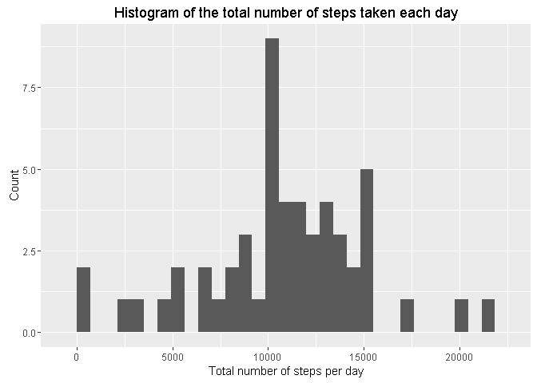
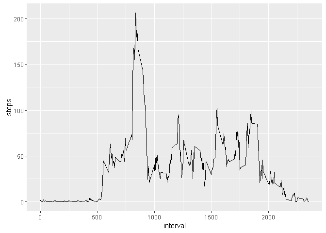
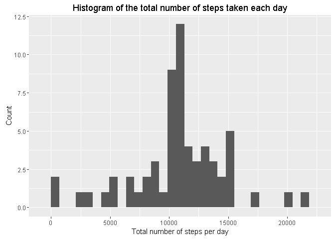
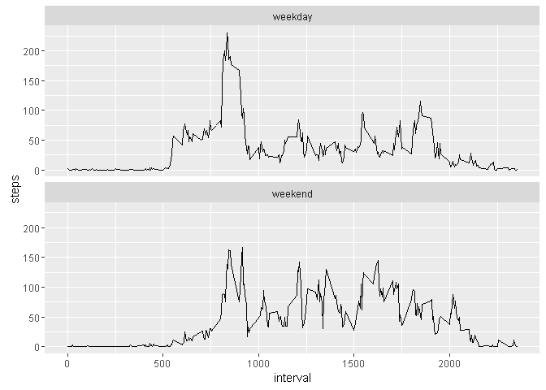

# Reproducible Research: Peer Assessment 1
Samuel Chan - Coursera Data Science Specialization  


## Loading and preprocessing the data

Show any code that is needed to

1. Load the data (i.e. read.csv())

2. Process/transform the data (if necessary) into a format suitable for your analysis

```r
#1)Read dataset
df <- read.csv(unz("./activity.zip","activity.csv"))
```


## What is mean total number of steps taken per day?

For this part of the assignment, you can ignore the missing values in the dataset.

1. Calculate the total number of steps taken per day
2. If you do not understand the difference between a histogram and a barplot, research the difference between them. Make a histogram of the total number of steps taken each day
3. Calculate and report the mean and median of the total number of steps taken per day


```r
library(ggplot2)
```

```
## Warning: package 'ggplot2' was built under R version 3.2.3
```

```r
#make a dataset that has no NA value
df2 <- df[complete.cases(df),]

#aggregate total number of steps by date
total.steps.each.day <- aggregate(df2$steps, by = list(df2$date), FUN="sum")
colnames(total.steps.each.day) <- c("date","steps")

#make a histogram
qplot(total.steps.each.day$steps, geom="histogram",  
      main = "Histogram of the total number of steps taken each day",
      xlab="Total number of steps per day", ylab="Count")
```

```
## `stat_bin()` using `bins = 30`. Pick better value with `binwidth`.
```



```r
#Calculate the mean and median number of steps taken each day
mean(total.steps.each.day$steps) #10766.19
```

```
## [1] 10766.19
```

```r
median(total.steps.each.day$steps) #10765
```

```
## [1] 10765
```


## What is the average daily activity pattern?

1. Make a time series plot (i.e. type = "l") of the 5-minute interval (x-axis) and the average number of steps taken, averaged across all days (y-axis)
2. Which 5-minute interval, on average across all the days in the dataset, contains the maximum number of steps?


```r
#Aggregate the mean of steps by interval
steps.per.interval <- aggregate(df2$steps, by = list(df2$interval), FUN="mean")
colnames(steps.per.interval) <- c("interval","steps")

#Make a time series plot of the average number of steps taken
qplot(x=interval,y=steps, data=steps.per.interval, geom="line")
```



```r
#Get the 5-minute interval that, on average, contains the maximum number of steps
row.id <- which.max(steps.per.interval$steps)
steps.per.interval[row.id,]
```

```
##     interval    steps
## 104      835 206.1698
```
The interval 835 contains the max number of steps - 206.1698


## Imputing missing values

Note that there are a number of days/intervals where there are missing values (coded as NA). The presence of missing days may introduce bias into some calculations or summaries of the data.

1. Calculate and report the total number of missing values in the dataset (i.e. the total number of rows with NAs)
2. Devise a strategy for filling in all of the missing values in the dataset. The strategy does not need to be sophisticated. For example, you could use the mean/median for that day, or the mean for that 5-minute interval, etc.
3. Create a new dataset that is equal to the original dataset but with the missing data filled in.
4. Make a histogram of the total number of steps taken each day and Calculate and report the mean and median total number of steps taken per day. Do these values differ from the estimates from the first part of the assignment? What is the impact of imputing missing data on the estimates of the total daily number of steps?


```r
#Calculate the total number of missing values
sum(is.na(df$steps))
```

```
## [1] 2304
```

```r
#My strategy: replace NA by mean of that 5 min interval
#Create a dataset with the missing data filled in
df3 <- df

# Loop each row, check if it's value is missing
for(i in 1:nrow(df3)){
  if (is.na(df3[i,]$steps)) {
    #If missing, get the interval and the step value of that interval
    tmp.interval <- df3[i,]$interval
    interval.mean.step <- steps.per.interval[steps.per.interval$interval
                                             ==  tmp.interval,]$steps
    df3[i,]$steps <- interval.mean.step
  }
}

#Make a histogram of the total number of steps taken each day after missing 
#   values are imputed

#Aggregate the sum of steps by date
total.steps.each.day <- aggregate(df3$steps, by = list(df3$date), FUN="sum")
table_date_steps <- aggregate(steps ~ date, df3, sum)
colnames(total.steps.each.day) <- c("date","steps")

#Make the histogram required
qplot(total.steps.each.day$steps, geom="histogram",  
      main = "Histogram of the total number of steps taken each day",
      xlab="Total number of steps per day", ylab="Count")
```

```
## `stat_bin()` using `bins = 30`. Pick better value with `binwidth`.
```



```r
#Get the mean and median of this dataset

mean(total.steps.each.day$steps) #10766.19
```

```
## [1] 10766.19
```

```r
median(total.steps.each.day$steps) #10766.19
```

```
## [1] 10766.19
```
Mean remains unchanged, median decreased slightly.


## Are there differences in activity patterns between weekdays and weekends?

For this part the weekdays() function may be of some help here. Use the dataset with the filled-in missing values for this part.

1. Create a new factor variable in the dataset with two levels – "weekday" and "weekend" indicating whether a given date is a weekday or weekend day.
2. Make a panel plot containing a time series plot (i.e. type = "l") of the 5-minute interval (x-axis) and the average number of steps taken, averaged across all weekday days or weekend days (y-axis). See the README file in the GitHub repository to see an example of what this plot should look like using simulated data.


```r
#Set locale
Sys.setlocale("LC_TIME", "English")
```

```
## [1] "English_United States.1252"
```

```r
#Determine the day and create a new column "day" to store this information
df4 <- df3
df4$date <- as.Date(df4$date, "%Y-%m-%d")
df4$day <- weekdays(df4$date)

#Create a new column "type" for indicate it is weekend of weekday
df4$type <- "--" 

#Loop the data frame, if the day is Sunday or Saturday, assign "weekend" to 
#"type", else assign "weekday"
for (i in 1:nrow(df4)) {
  if (df4$day[i] == "Sunday" || df4$day[i] == "Saturday") {
    df4$type[i] <- "weekend" 
  } else {
    df4$type[i] <- "weekday" 
  }
}

#Convert the column "type" to factor
df4$type <- as.factor(df4$type)

#Aggregate the mean of steps by interval and the type of day in the data frame
steps.per.interval <- aggregate(df4$steps, by = list(df4$interval,df4$type), FUN="mean")
colnames(steps.per.interval) <- c("interval","type","steps")

#Make a panel plot
qplot(x=interval,y=steps, data=steps.per.interval, geom="line")+ 
        facet_wrap(~ type, ncol=1)
```



